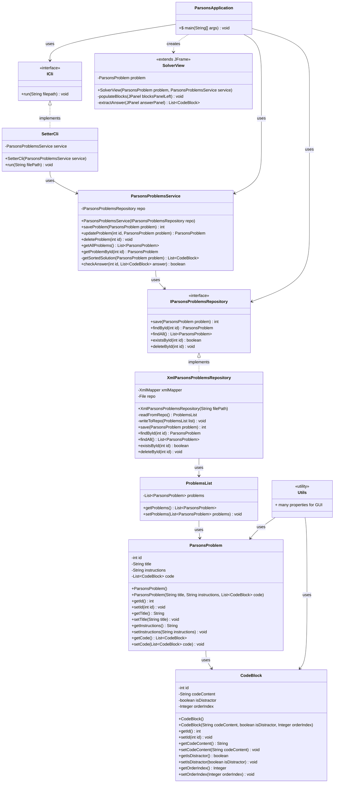

## Final UML Diagram

```mermaid
classDiagram
  direction TB

  class ParsonsApplication {
    - ParsonsApplication()
    + main(String[]) void
  }

  namespace Controller_View {
      class BaseParsonsView {
        # BaseParsonsView(ParsonsProblem, String)
        - JPanel answerPanelRight
        - JLabel responseLabel
        - ParsonsProblem problem
        - JPanel centerPanel
        - JPanel topPanel
        # populateBlocks() void
        # resetForRetry() void
        # extractAnswer() List~CodeBlock~
        JPanel answerPanelRight
        ParsonsProblem problem
        JLabel responseLabel
        JPanel topPanel
        JPanel centerPanel
      }

      class CodeBlock {
        + CodeBlock(String, boolean, Integer)
        + CodeBlock()
        - int id
        - String codeContent
        - Integer orderIndex
        boolean isDistractor
        Integer orderIndex
        int id
        String codeContent
      }

      class EditorView {
        + EditorView(ParsonsProblem, ParsonsProblemsService, String, SetterWelcomeView)
        - buildTitle(ParsonsProblem) String
        - checkAnswerLocally(List~CodeBlock~) boolean
        - buildTopExtras() void
        - refreshAndClose(SetterWelcomeView, ParsonsProblemsService) void
      }

      class HomeController {
        + HomeController(ParsonsProblemsService)
      }

      class ICli {
        <<Interface>>
        + run(String) void
      }

      class SetterWelcomeView {
        + SetterWelcomeView(ParsonsProblemsService, String)
        # populateTable() void
        # onRowSelected(int) void
      }

      class SolverView {
        + SolverView(ParsonsProblem, ParsonsProblemsService, int)
      }

      class StudentWelcomeView {
        + StudentWelcomeView(ParsonsProblemsService)
        # onRowSelected(int) void
        # populateTable() void
      }

      class Utils {
        - Utils()
        + createCreditsPanel() JPanel
        + createNavBar(boolean, boolean, JFrame) JPanel
        + makeCodeBlock(String) JLabel
        + makeDropTarget(JPanel) void
        + parseFile(String) List~ParsonsProblem~
      }

      class WelcomeView {
        # WelcomeView(ParsonsProblemsService, String, String, String)
        - DefaultTableModel tableModel
        - ParsonsProblemsService service
        # populateTable() void
        # onRowSelected(int) void
        ParsonsProblemsService service
        DefaultTableModel tableModel
        List~ParsonsProblem~ parsonsProblems
      }
  }

  namespace Model {
    class IParsonsProblemsRepository {
      <<Interface>>
      + save(ParsonsProblem) int
      + existsById(int) boolean
      + deleteById(int) void
      + findById(int) ParsonsProblem
      + findAll() List~ParsonsProblem~
    }

    class ParsonsProblem {
      + ParsonsProblem(String, String, List~CodeBlock~)
      + ParsonsProblem()
      - List~CodeBlock~ code
      - String title
      - String instructions
      - int id
      List~CodeBlock~ code
      int id
      String title
      String instructions
    }

    class ParsonsProblemsService {
      + ParsonsProblemsService(IParsonsProblemsRepository)
      + updateProblem(int, ParsonsProblem) ParsonsProblem
      + deleteProblem(int) void
      - getSortedSolution(ParsonsProblem) List~CodeBlock~
      + getProblemById(int) ParsonsProblem
      + checkAnswer(int, List~CodeBlock~) boolean
      + saveProblem(ParsonsProblem) int
      List~ParsonsProblem~ allProblems
    }

    class ProblemsList {
      + ProblemsList()
      - List~ParsonsProblem~ problems
      List~ParsonsProblem~ problems
    }

    class SetterCli {
      + SetterCli(ParsonsProblemsService)
      + run(String) void
    }

    class XmlParsonsProblemsRepository {
      + XmlParsonsProblemsRepository(String)
      - readFromRepo() ProblemsList
      + save(ParsonsProblem) int
      - writeToRepo(ProblemsList) void
      + deleteById(int) void
      + findAll() List~ParsonsProblem~
      + existsById(int) boolean
      + findById(int) ParsonsProblem
    }
  }
%% extends
EditorView --|> BaseParsonsView
SolverView --|> BaseParsonsView
SetterWelcomeView --|> WelcomeView
StudentWelcomeView --|> WelcomeView

%% implements
SetterCli ..|> ICli
XmlParsonsProblemsRepository ..|> IParsonsProblemsRepository

%% uses
BaseParsonsView ..> CodeBlock
BaseParsonsView ..> ParsonsProblem
BaseParsonsView ..> Utils
EditorView ..> CodeBlock
EditorView ..> ParsonsProblem
EditorView ..> ParsonsProblemsService
EditorView ..> SetterWelcomeView
EditorView ..> Utils
HomeController ..> ParsonsProblemsService
HomeController ..> SetterWelcomeView
HomeController ..> StudentWelcomeView
IParsonsProblemsRepository ..> ParsonsProblem
ParsonsApplication ..> HomeController
ParsonsApplication ..> ICli
ParsonsApplication ..> IParsonsProblemsRepository
ParsonsApplication ..> ParsonsProblemsService
ParsonsApplication ..> SetterCli
ParsonsApplication ..> XmlParsonsProblemsRepository
ParsonsProblemsService ..> CodeBlock
ParsonsProblemsService ..> IParsonsProblemsRepository
ParsonsProblemsService ..> ParsonsProblem
SetterCli ..> ParsonsProblem
SetterCli ..> ParsonsProblemsService
SetterCli ..> Utils
SetterWelcomeView ..> EditorView
SetterWelcomeView ..> ParsonsProblem
SetterWelcomeView ..> ParsonsProblemsService
SolverView ..> CodeBlock
SolverView ..> ParsonsProblem
SolverView ..> ParsonsProblemsService
StudentWelcomeView ..> ParsonsProblem
StudentWelcomeView ..> ParsonsProblemsService
StudentWelcomeView ..> SolverView
Utils ..> CodeBlock
Utils ..> ParsonsProblem
WelcomeView ..> ParsonsProblem
WelcomeView ..> ParsonsProblemsService
WelcomeView ..> Utils
XmlParsonsProblemsRepository ..> ParsonsProblem
XmlParsonsProblemsRepository ..> ProblemsList
```

## UML Diagram for Proposal Design

```mermaid
classDiagram

%% Model

class CodeBlock {
    -int id
    -String codeContent
    -boolean isDistractor
    -Integer orderIndex
    +CodeBlock()
    +CodeBlock(String codeContent, boolean isDistractor, Integer orderIndex)
    +getId() int
    +setId(int id) void
    +getCodeContent() String
    +setCodeContent(String codeContent) void
    +getIsDistractor() boolean
    +setIsDistractor(boolean isDistractor) void
    +getOrderIndex() Integer
    +setOrderIndex(Integer orderIndex) void
}

class ParsonsProblem {
    -int id
    -String title
    -String instructions
    -List~CodeBlock~ code
    +ParsonsProblem()
    +ParsonsProblem(String title, String instructions, List~CodeBlock~ code)
    +getId() int
    +setId(int id) void
    +getTitle() String
    +setTitle(String title) void
    +getInstructions() String
    +setInstructions(String instructions) void
    +getCode() List~CodeBlock~
    +setCode(List~CodeBlock~ code) void
}

class ProblemsList {
    -List~ParsonsProblem~ problems
    +getProblems() List~ParsonsProblem~
    +setProblems(List~ParsonsProblem~ problems) void
}

ParsonsProblem --> CodeBlock : uses
ProblemsList --> ParsonsProblem : uses

%% Repository

class IParsonsProblemsRepository {
    <<interface>>
    +save(ParsonsProblem problem) int
    +findById(int id) ParsonsProblem
    +findAll() List~ParsonsProblem~
    +existsById(int id) boolean
    +deleteById(int id) void
}

class XmlParsonsProblemsRepository {
    -XmlMapper xmlMapper
    -File repo
    +XmlParsonsProblemsRepository(String filePath)
    -readFromRepo() ProblemsList
    -writeToRepo(ProblemsList list) void
    +save(ParsonsProblem problem) int
    +findById(int id) ParsonsProblem
    +findAll() List~ParsonsProblem~
    +existsById(int id) boolean
    +deleteById(int id) void
}

IParsonsProblemsRepository <|.. XmlParsonsProblemsRepository : implements
XmlParsonsProblemsRepository --> ProblemsList : uses

%% Service

class ParsonsProblemsService {
    -IParsonsProblemsRepository repo
    +ParsonsProblemsService(IParsonsProblemsRepository repo)
    +saveProblem(ParsonsProblem problem) int
    +updateProblem(int id, ParsonsProblem problem) ParsonsProblem
    +deleteProblem(int id) void
    +getAllProblems() List~ParsonsProblem~
    +getProblemById(int id) ParsonsProblem
    -getSortedSolution(ParsonsProblem problem) List~CodeBlock~
    +checkAnswer(int id, List~CodeBlock~ answer) boolean
}

ParsonsProblemsService --> IParsonsProblemsRepository : uses

%% Controller: CLI

class ICli {
    <<interface>>
    +run(String filepath) void
}

class SetterCli {
    -ParsonsProblemsService service
    +SetterCli(ParsonsProblemsService service)
    +run(String filePath) void
}

ICli <|.. SetterCli : implements
SetterCli --> ParsonsProblemsService : uses

%% Controller: Utils

class Utils {
    <<utility>>
    + many properties for GUI
}

Utils --> ParsonsProblem : uses
Utils --> CodeBlock : uses

%% Controller: Views

class SolverView {
    <<extends JFrame>>
    -ParsonsProblem problem
    +SolverView(ParsonsProblem problem, ParsonsProblemsService service)
    -populateBlocks(JPanel blocksPanelLeft) void
    -extractAnswer(JPanel answerPanel) List~CodeBlock~
}


%% App Entry

class ParsonsApplication {
    +$ main(String[] args) void
}

ParsonsApplication --> IParsonsProblemsRepository : uses
ParsonsApplication --> ParsonsProblemsService : uses
ParsonsApplication ..> SolverView : creates
ParsonsApplication --> ICli : uses
```
