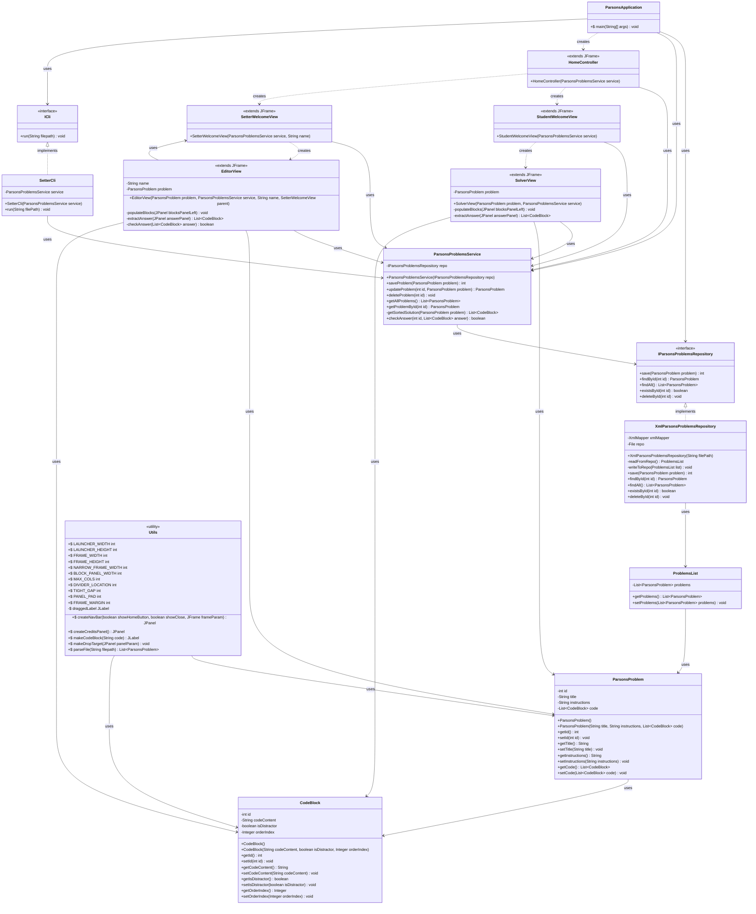

## Final UML Diagram

```mermaid
classDiagram

%% Model

class CodeBlock {
    -int id
    -String codeContent
    -boolean isDistractor
    -Integer orderIndex
    +CodeBlock()
    +CodeBlock(String codeContent, boolean isDistractor, Integer orderIndex)
    +getId() int
    +setId(int id) void
    +getCodeContent() String
    +setCodeContent(String codeContent) void
    +getIsDistractor() boolean
    +setIsDistractor(boolean isDistractor) void
    +getOrderIndex() Integer
    +setOrderIndex(Integer orderIndex) void
}

class ParsonsProblem {
    -int id
    -String title
    -String instructions
    -List~CodeBlock~ code
    +ParsonsProblem()
    +ParsonsProblem(String title, String instructions, List~CodeBlock~ code)
    +getId() int
    +setId(int id) void
    +getTitle() String
    +setTitle(String title) void
    +getInstructions() String
    +setInstructions(String instructions) void
    +getCode() List~CodeBlock~
    +setCode(List~CodeBlock~ code) void
}

class ProblemsList {
    -List~ParsonsProblem~ problems
    +getProblems() List~ParsonsProblem~
    +setProblems(List~ParsonsProblem~ problems) void
}

ParsonsProblem --> CodeBlock : uses
ProblemsList --> ParsonsProblem : uses

%% Repository

class IParsonsProblemsRepository {
    <<interface>>
    +save(ParsonsProblem problem) int
    +findById(int id) ParsonsProblem
    +findAll() List~ParsonsProblem~
    +existsById(int id) boolean
    +deleteById(int id) void
}

class XmlParsonsProblemsRepository {
    -XmlMapper xmlMapper
    -File repo
    +XmlParsonsProblemsRepository(String filePath)
    -readFromRepo() ProblemsList
    -writeToRepo(ProblemsList list) void
    +save(ParsonsProblem problem) int
    +findById(int id) ParsonsProblem
    +findAll() List~ParsonsProblem~
    +existsById(int id) boolean
    +deleteById(int id) void
}

IParsonsProblemsRepository <|.. XmlParsonsProblemsRepository : implements
XmlParsonsProblemsRepository --> ProblemsList : uses

%% Service

class ParsonsProblemsService {
    -IParsonsProblemsRepository repo
    +ParsonsProblemsService(IParsonsProblemsRepository repo)
    +saveProblem(ParsonsProblem problem) int
    +updateProblem(int id, ParsonsProblem problem) ParsonsProblem
    +deleteProblem(int id) void
    +getAllProblems() List~ParsonsProblem~
    +getProblemById(int id) ParsonsProblem
    -getSortedSolution(ParsonsProblem problem) List~CodeBlock~
    +checkAnswer(int id, List~CodeBlock~ answer) boolean
}

ParsonsProblemsService --> IParsonsProblemsRepository : uses

%% Controller: CLI

class ICli {
    <<interface>>
    +run(String filepath) void
}

class SetterCli {
    -ParsonsProblemsService service
    +SetterCli(ParsonsProblemsService service)
    +run(String filePath) void
}

ICli <|.. SetterCli : implements
SetterCli --> ParsonsProblemsService : uses

%% Controller: Utils

class Utils {
    <<utility>>
    +$ LAUNCHER_WIDTH int
    +$ LAUNCHER_HEIGHT int
    +$ FRAME_WIDTH int
    +$ FRAME_HEIGHT int
    +$ NARROW_FRAME_WIDTH int
    +$ BLOCK_PANEL_WIDTH int
    +$ MAX_COLS int
    +$ DIVIDER_LOCATION int
    +$ TIGHT_GAP int
    +$ PANEL_PAD int
    +$ FRAME_MARGIN int
    -$ draggedLabel JLabel
    +$ createNavBar(boolean showHomeButton, boolean showClose, JFrame frameParam) JPanel
    +$ createCreditsPanel() JPanel
    +$ makeCodeBlock(String code) JLabel
    +$ makeDropTarget(JPanel panelParam) void
    +$ parseFile(String filepath) List~ParsonsProblem~
}

Utils --> ParsonsProblem : uses
Utils --> CodeBlock : uses

%% Controller: Views

class HomeController {
    <<extends JFrame>>
    +HomeController(ParsonsProblemsService service)
}

class StudentWelcomeView {
    <<extends JFrame>>
    +StudentWelcomeView(ParsonsProblemsService service)
}

class SolverView {
    <<extends JFrame>>
    -ParsonsProblem problem
    +SolverView(ParsonsProblem problem, ParsonsProblemsService service)
    -populateBlocks(JPanel blocksPanelLeft) void
    -extractAnswer(JPanel answerPanel) List~CodeBlock~
}

class SetterWelcomeView {
    <<extends JFrame>>
    +SetterWelcomeView(ParsonsProblemsService service, String name)
}

class EditorView {
    <<extends JFrame>>
    -String name
    -ParsonsProblem problem
    +EditorView(ParsonsProblem problem, ParsonsProblemsService service, String name, SetterWelcomeView parent)
    -populateBlocks(JPanel blocksPanelLeft) void
    -extractAnswer(JPanel answerPanel) List~CodeBlock~
    -checkAnswer(List~CodeBlock~ answer) boolean
}

HomeController --> ParsonsProblemsService : uses
HomeController ..> StudentWelcomeView : creates
HomeController ..> SetterWelcomeView : creates

StudentWelcomeView --> ParsonsProblemsService : uses
StudentWelcomeView ..> SolverView : creates

SolverView --> ParsonsProblemsService : uses
SolverView --> ParsonsProblem : uses
SolverView --> CodeBlock : uses

SetterWelcomeView --> ParsonsProblemsService : uses
SetterWelcomeView ..> EditorView : creates

EditorView --> ParsonsProblemsService : uses
EditorView --> ParsonsProblem : uses
EditorView --> CodeBlock : uses
EditorView --> SetterWelcomeView : uses


%% App Entry

class ParsonsApplication {
    +$ main(String[] args) void
}

ParsonsApplication --> IParsonsProblemsRepository : uses
ParsonsApplication --> ParsonsProblemsService : uses
ParsonsApplication ..> HomeController : creates
ParsonsApplication --> ICli : uses
```
