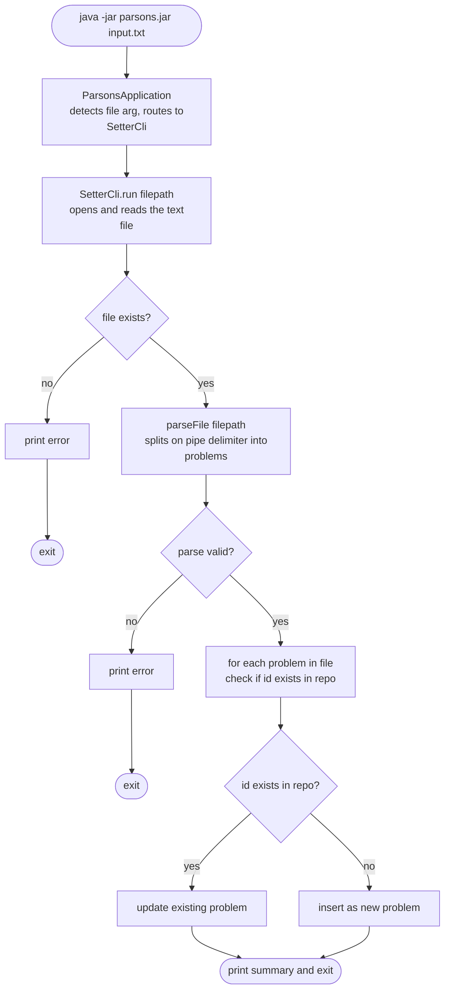
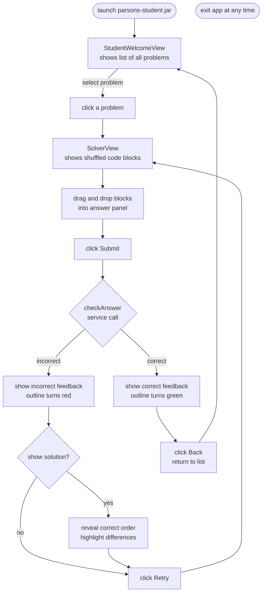
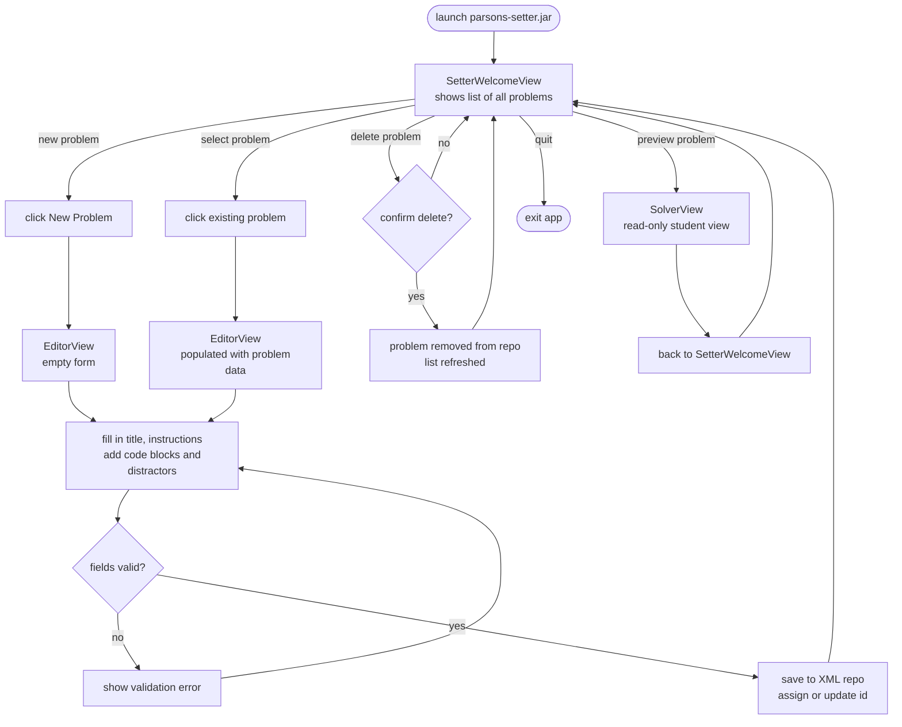
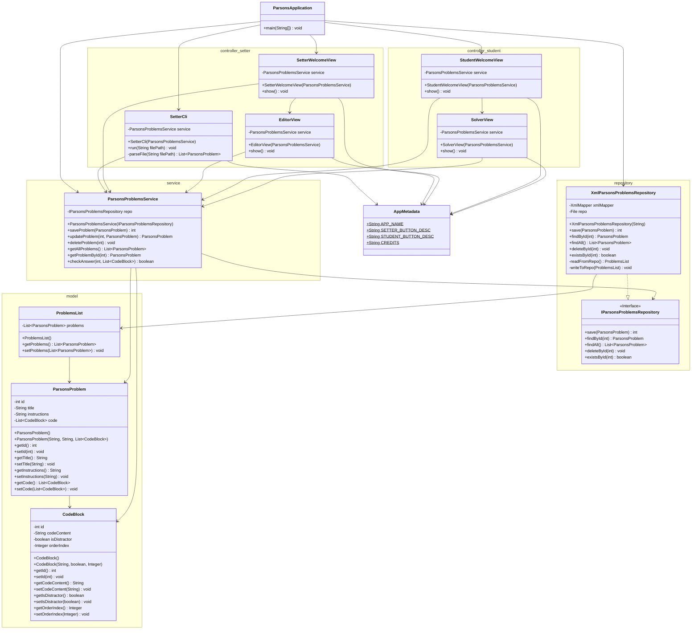

# Design Documents

You may have multiple design documents for this project. Place them all in this folder. File naming is up to you, but it should be clear what the document is about. At the bare minimum, you will want a pre/post UML diagram for the project.


## Initial Design Thoughts: Also Counting Features

Note: Swing UI supports drag and drop:
https://docs.oracle.com/javase/tutorial/uiswing/examples/dnd/index.html


### FlowChart for Setter using CLI 

FEATURE 1: Setting problems from CLI by passing a text file

FEATURE 2: reasonable accommodation for spelling mistake in text files

In the text files, ParsonsProblem are separated by ---

Parsing expects the following structure:

1. First line of each ParsonsProblem is id, an int. 
   * For a new problem use int <= 0 (is not honored, the program returns a new id based on the current max id). 
   * If problem is being updated/edited, correct id is needed.
   * Another way (if user cannot recall id) - create a new problem and delete the older version using browser -- cannot be done via CLI so far.

2. Second line is the instructions. 
   * Assumed all correct. Treated as a final String.

3. All other lines (\n) are expected to be ParsonProblem with three elements separated by a pipe "|".
   * First element isDistractor, second the index and third the CodeBlock. 
   * `isDistractor` can have the following valid values: `t` and `f`; this way partials of `true` and `false` are accepted. There can be leading or trailing spaces.
   * for a distractor, index field is ignored 
   * Leading and trailing spaces are ignored other than "\t\s*" or "\t" for 4-space tabbing.

```text
EXAPLE_TWO_PROBLEMS.txt

// empty lines are ignored

id      // an int - non-negotiatble
false | 0 | int findMin(List list) {
// for tabbing "\t " is useful for clarity
false | 1 | \t int min = list[0];
// index 1 is incorrect but inconsequential
true | 1 | \t min = list[0];
// f is enough for isDistrator; is parsed false
f | 2 | \t for (int i = 0; i < list.size(); i++) {
// ture is acceptable for isDistrator since it starts with t; is parsed true
ture | 2 | \t for ( i = 0; i < list.size(); i++) {
}
// "\t" is also acceptable for tabbing
false | 3 |\t\t if (list[i] < min) {        
false| 4 | \t\t\t min = list[i];
false| 5 | \t\t }
false| 6 | \t }
false| 7 | \t return min;
// flase is acceptable for isDistrator since it starts with f; is parsed false
flase| 8 | }

// empty lines are ignored

---             // problems are separated by three dashes

// empty lines are ignored

id_next     // an int 
false | 0 | int findMax(List list) {
// for tabbing "\t " is useful for clarity
fal | 1 | \t int max = list[0];
// index 1 is incorrect but inconsequential
true | 1 | \t max = list[0]; 
f | 2 | \t for (int i = 0; i < list.size(); i++) {
// t is enough for isDistrator; is parsed true
t | 2 | \t for ( i = 0; i < list.size(); i++) {
}
// "\t" is also acceptable for tabbing
false | 3 |\t\t if (list[i] > min) {        
false| 4 | \t\t\t max = list[i];
false| 5 | \t\t }
false| 6 | \t }
false| 7 | \t return max;
// flase is acceptable for isDistrator since it starts with f; is parsed false
flase| 8 | }
```




### Student's FlowChart

Feature 3: Student can browse all problems

Feature 4: Student gets to retry as many times as they want with instant feedback




### Setter's Editor GUI view (with Student View Preview)

Feature 5: editor can write the ParsonsProblem's instruction and CodeBlocks directly using a GUI `textField`.

Feature 6: choose distractor `boolean` with a radio button.



### Dependency Map
[Legend: --> =  depends on]

`Swing UI/Controller  --> Service --> Repository --> Model`


### File Structure
```
com.parsons/
|
|-- model/
|   |-- CodeBlock.java
|   |-- ParsonsProblem.java
|   |-- ProblemsList.java
|
|-- repository/
|   |-- IParsonsProblemsRepository.java
|   |-- XmlParsonsProblemsRepository.java
|
|-- service/
|   |-- ParsonsProblemsService.java
|
|-- controller/
|   |-- setter/
|   |   |-- SetterCli.java
|   |   |-- SetterView.java* (maybe)
|   |   |-- EditorView.java* (maybe)
|   |-- student/
|       |-- StudentView.java
|       |-- SolverView.java
|
|-- AppMetadata.java
|-- ParsonsApplication.java
```
### Design/Vision UML




## Initial Design: Student GUI SolverView 

```
 ---------------------------------------------------
│                                           [quit]  │
|                  Instructions                     |
| ---------------------  -------------------------- |
│  BLOCKS (pick up)     │  ANSWER (drop here)       │
│   ---------------     │                           │
│   │  int i;      │    │                           │
│   ├──────────────┤    │                           │
│   │  i = 0;      │    │                           │
│   ├──────────────┤    │                           │
│   │while(i<10){  │    │                           │
│   ----------------    │                           │
│                       │          [Submit]         │
 ---------------------------------------------------
```

