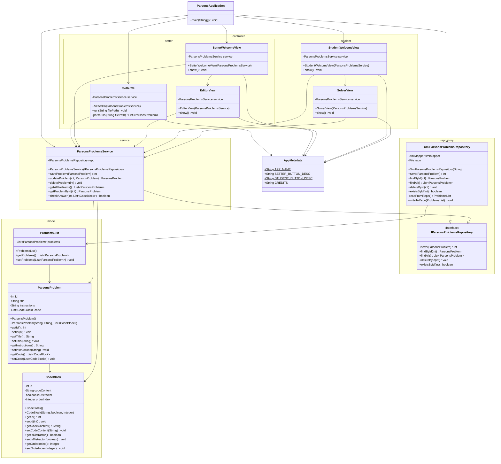

# Design Documents

You may have multiple design documents for this project. Place them all in this folder. File naming is up to you, but it should be clear what the document is about. At the bare minimum, you will want a pre/post UML diagram for the project.

## Initial Design Thoughts

Swing UI supports drag and drop:
https://docs.oracle.com/javase/tutorial/uiswing/examples/dnd/index.html


### Dependency Map
[Legend: --> =  depends on]

Swing UI/Controller  --> Service --> Repository --> Model


### Application Flow

`ParsonsApplication` (main) --creates--> `XmlParsonsProblemsRepository` --injected into--> `ParsonsProblemsService`
--injected into-->Swing UI--calls-->`ParsonsProblemsService` (when button clicked)


### File Structure
```
com.parsons/
|
|-- model/
|   |-- CodeBlock.java
|   |-- ParsonsProblem.java
|   |-- ProblemsList.java
|
|-- repository/
|   |-- IParsonsProblemsRepository.java
|   |-- XmlParsonsProblemsRepository.java
|
|-- service/
|   |-- ParsonsProblemsService.java
|
|-- controller/
|   |-- setter/
|   |   |-- SetterCli.java
|   |   |-- SetterView.java* (maybe)
|   |   |-- EditorView.java* (maybe)
|   |-- student/
|       |-- StudentView.java
|       |-- SolverView.java
|
|-- AppMetadata.java
|-- ParsonsApplication.java
```
### Design/Vision UML


