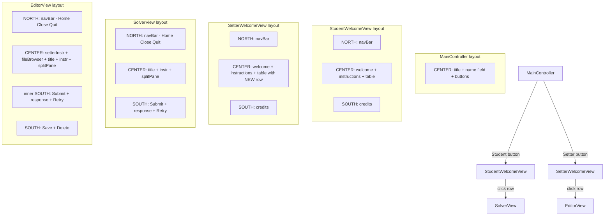

```mermaid

flowchart TD

    MC[MainController] -->|Student button| SWV[StudentWelcomeView]
    MC -->|Setter button| SeWV[SetterWelcomeView]
    SWV -->|click row| SV[SolverView]
    SeWV -->|click row| EV[EditorView]

    subgraph MC_layout [MainController layout]
        mc_c[CENTER: title + name field + buttons]
    end

    subgraph SWV_layout [StudentWelcomeView layout]
        swv_n[NORTH: navBar]
        swv_c[CENTER: welcome + instructions + table]
        swv_s[SOUTH: credits]
    end

    subgraph SeWV_layout [SetterWelcomeView layout]
        sewv_n[NORTH: navBar]
        sewv_c[CENTER: welcome + instructions + table with NEW row]
        sewv_s[SOUTH: credits]
    end

    subgraph SV_layout [SolverView layout]
        sv_n[NORTH: navBar - Home Close Quit]
        sv_c[CENTER: title + instr + splitPane]
        sv_s[SOUTH: Submit + response + Retry]
    end

    subgraph EV_layout [EditorView layout]
        ev_n[NORTH: navBar - Home Close Quit]
        ev_c[CENTER: setterInstr + fileBrowser + title + instr + splitPane]
        ev_cs[inner SOUTH: Submit + response + Retry]
        ev_s[SOUTH: Save + Delete]
    end
```