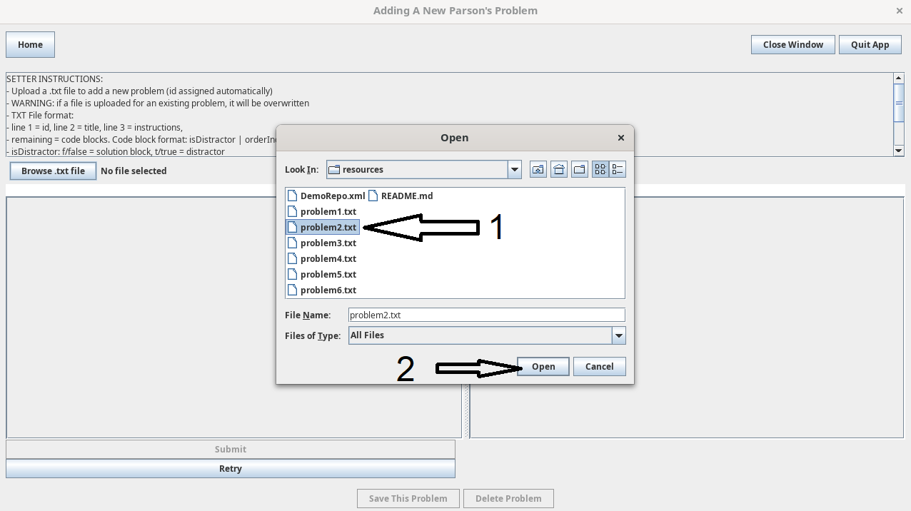
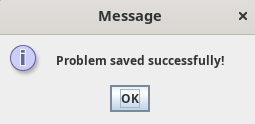
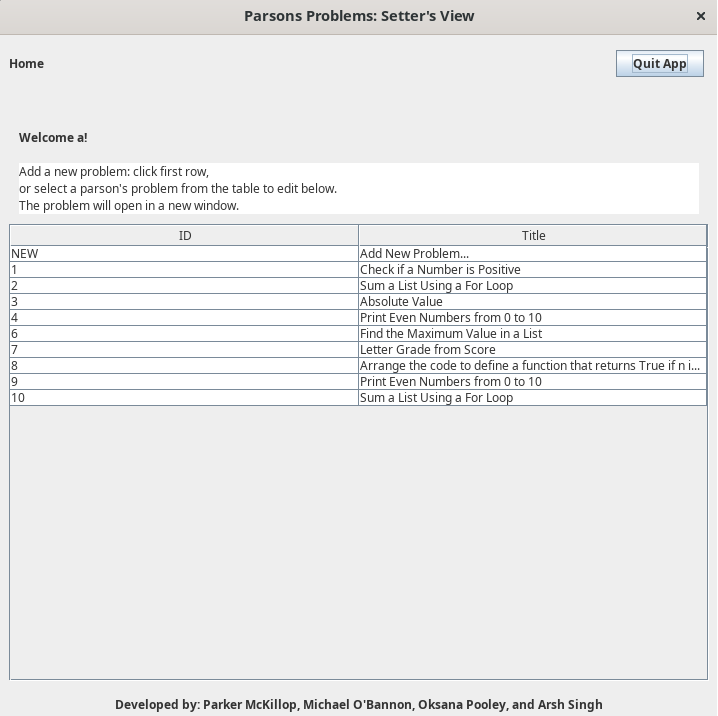

Once the editor view has been opened, either for updating an existing problem or creating a new one, the user can select "Browse .txt file". 

This will open the file chooser dialogue, allowing selection of a file. Once selected, the file can be opened to import it into the editor view.

Now that the problem has been imported, the setter has the ability to test the problem for themselves. The problem can then be saved to the local problems repository by clicking "Save this Problem".

After the button press, a successful save notification will appear. 

The editor view will then close, and the user will be brought back to the setter's welcome view.

