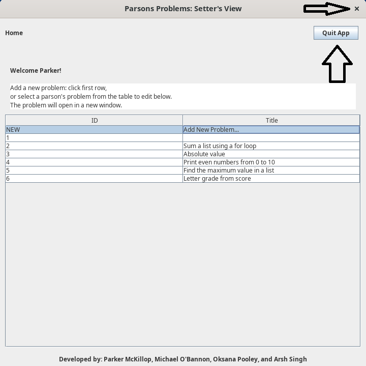
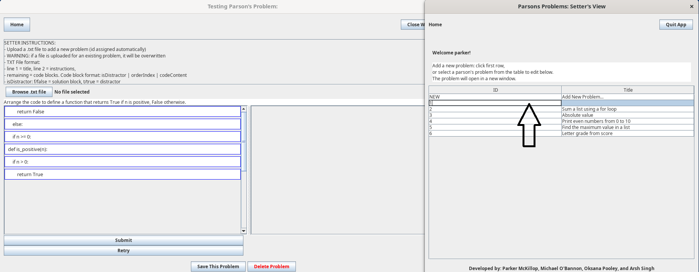

Once the user has opened the SetterWelcomeView, they'll be met with a screen presenting them with a way to exit the app, and a listing of problems that can be updated, as well as the option to create a fully new problem.

To exit the application in this state, the user can either select the "quit app" button, or the x in the top of the application

To access the editor view and create a new problem, the user can select "new" from the problem listing.

To overwrite a problem and import a new one its place, the user can select the existing problem.

