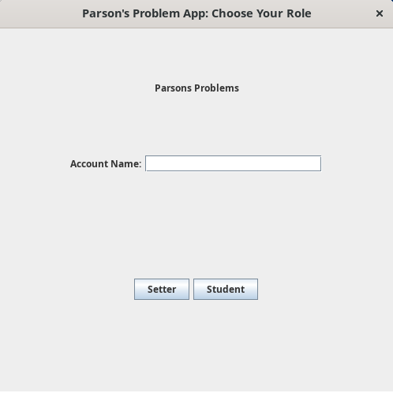
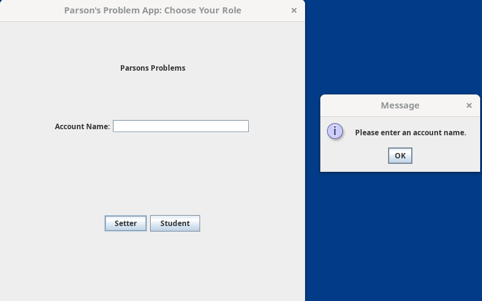
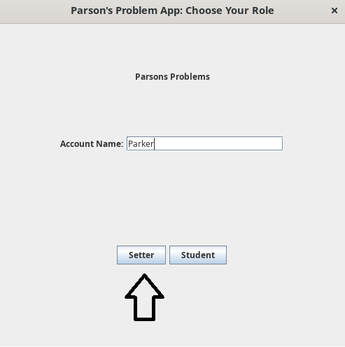
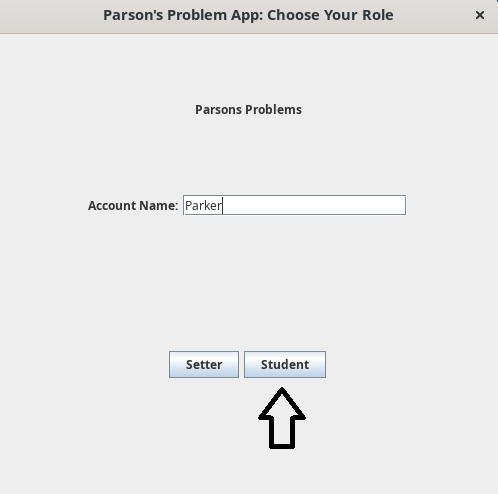

Once the program is running, you'll be met with the below HomeView page. This page is used to add a user account name, and select either the setter or student version of the app.

If the user attempts to access either the SetterWelcomeView or the StudentWelcome view without providing a username, the application will not allow the user to proceed.

| SetterWelcomeView access attempt without username | StudentWelcomeView access attempt without username |
|---|---|
|  |  |

Once the username has been added, the setter button will open the connected SetterWelcomeView.

| SetterWelcomeView Button Press | SetterWelcomeView Button Press Result |
|---|---|
|  |  |

Once the username has been added, the student button will open the connected StudentWelcomeView.

| StudentWelcomeView Button Press | StudentWelcomeView Button Press Result |
|---|---|
|  |  |