# Manual

## Running the Program

To run the program from terminal, navigate to the project's root directory and enter the following command:

```text
java -jar build/libs/parsons-problem-tool-0.1.jar 
```

## Home View

Once the program is running, you'll be met with the below HomeView page. This page is used to add a user account name, and select either the setter or student version of the app.


If the user attempts to access either the SetterWelcomeView or the StudentWelcomeView without providing a username, the application will not allow the user to proceed.

| SetterWelcomeView access attempt without username | StudentWelcomeView access attempt without username |
|---|---|
|  | 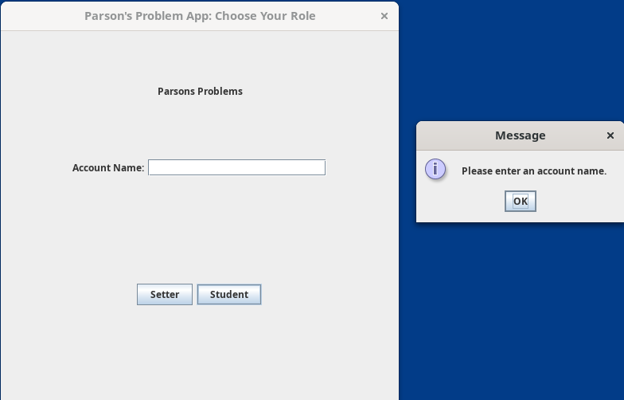 |
SetterWelcomeView.

| SetterWelcomeView Button Press | SetterWelcomeView Button Press Result |
|---|---|
|  | 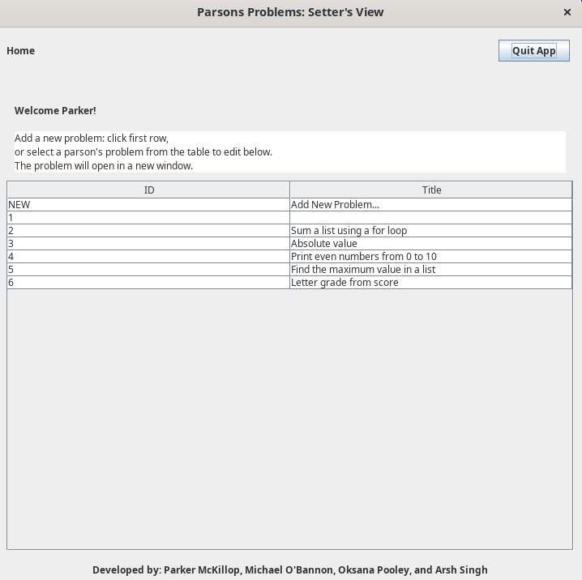 |

Likewise, the student button will open the StudentWelcomeView.

| StudentWelcomeView Button Press | StudentWelcomeView Button Press Result |
|---|---|
|  | 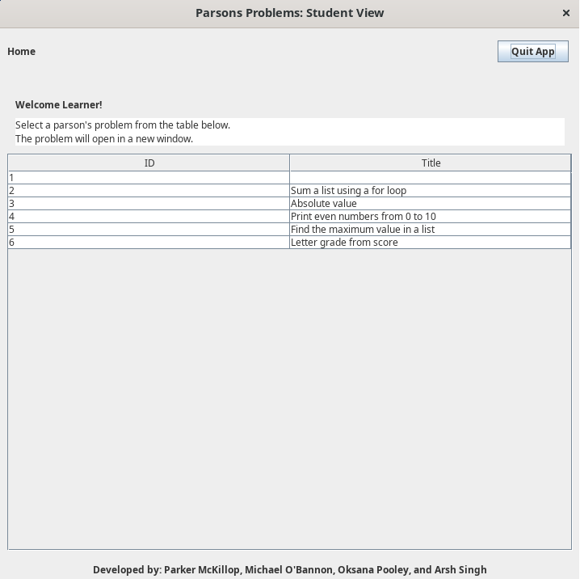 |

## Student Instructions: Solver View

From the SolverView, the user can exit the program by clicking `Close Window`, `Quit App`, or the `X` in the top right corner of the frame.   

   

The left-hand side of the solving problem screen contains puzzle pieces of a problem arranged in no particular order. In addition to the correct code, it also contains distractor piece(s).   

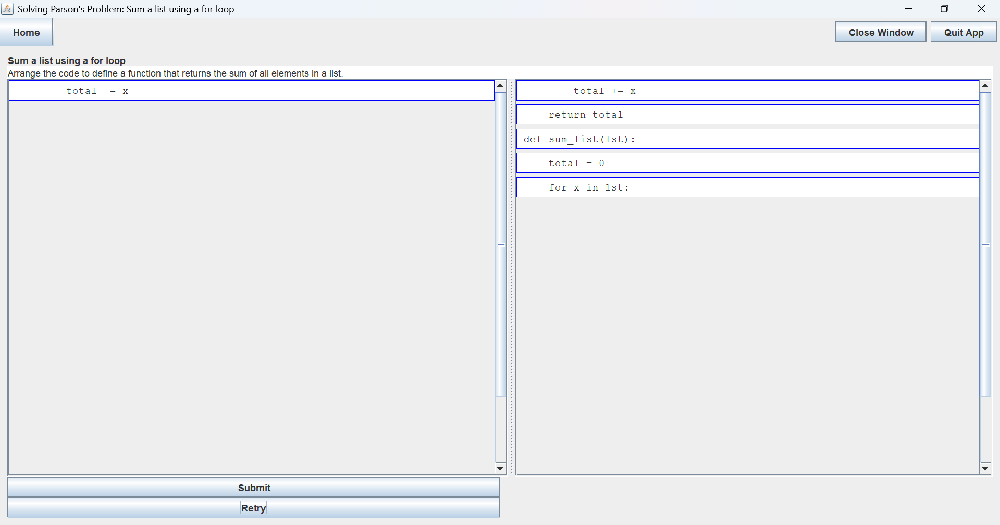   

The user moves puzzle pieces from the left side of the screen to the right side and arranges them in a presumably correct order. The pieces can only be added at the bottom.   

   

They can, however, be moved from the top or the middle to the bottom, or removed altogether and returned to the left-hand side of the screen. Once the user is satisfied with the order of the code puzzle pieces, clicking `Submit` will check if the answer is correct.     

   

If the answer is incorrect, the user can try again by clicking the `Retry` button and the puzzle pieces will return to the left panel.      

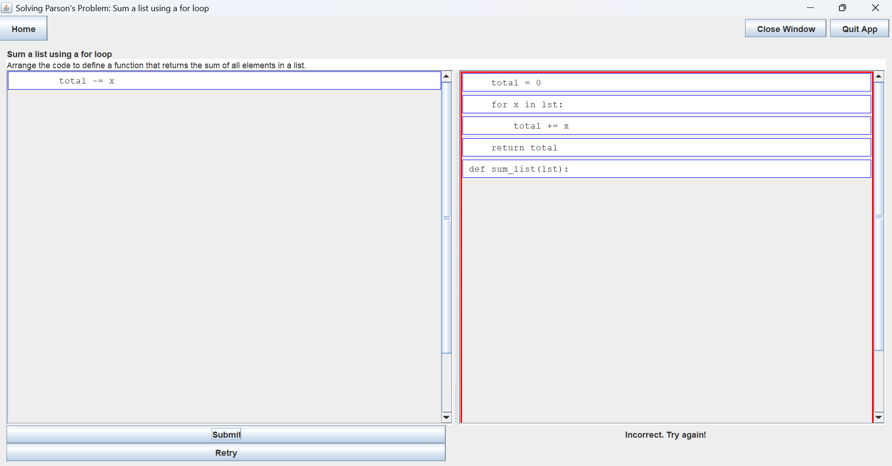
 
Another option in case of an incorrect answer,    


if the user sees the minor mistake and would like to correct it right away, they can move the few incorrect pieces,   

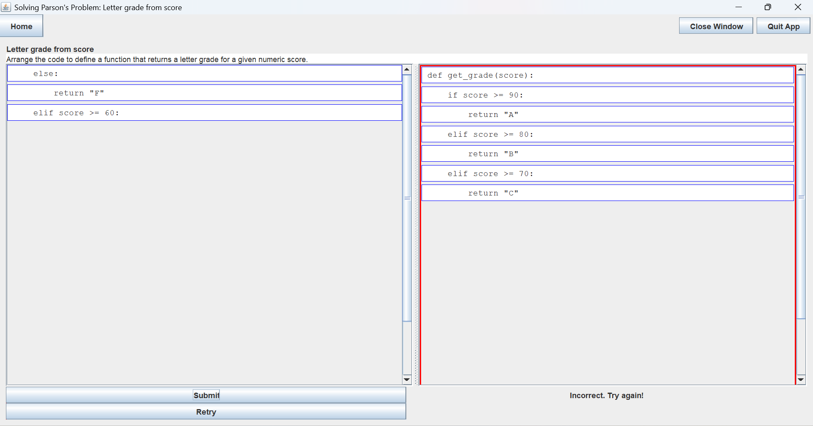   

rearrange them correctly, and try again by clicking `Submit`:   


## Setter Instructions: Setter/Editor View

Once the user has opened the SetterWelcomeView, they'll be met with a screen containing multiple options.

To exit the application in this state, the user can either select the "quit app" button, or the `X` in the top of the application


To access the editor view and create a new problem, the user can select "new" from the problem listing.

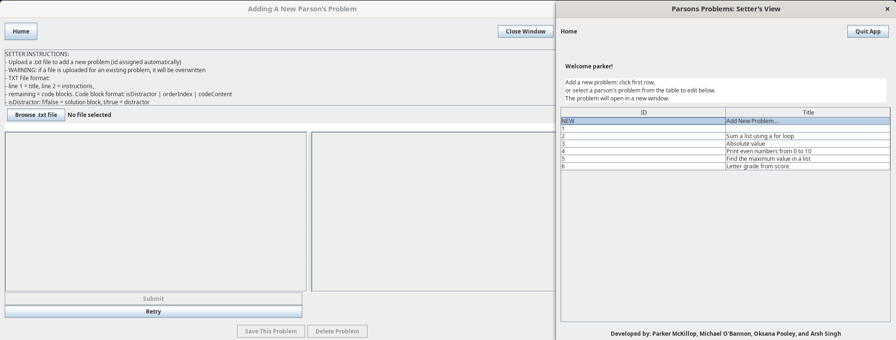

To overwrite a problem and import a new one in its place, the user can select the existing problem.


Once the editor view has been opened, either for updating an existing problem or creating a new one, the user can select "Browse .txt file". 

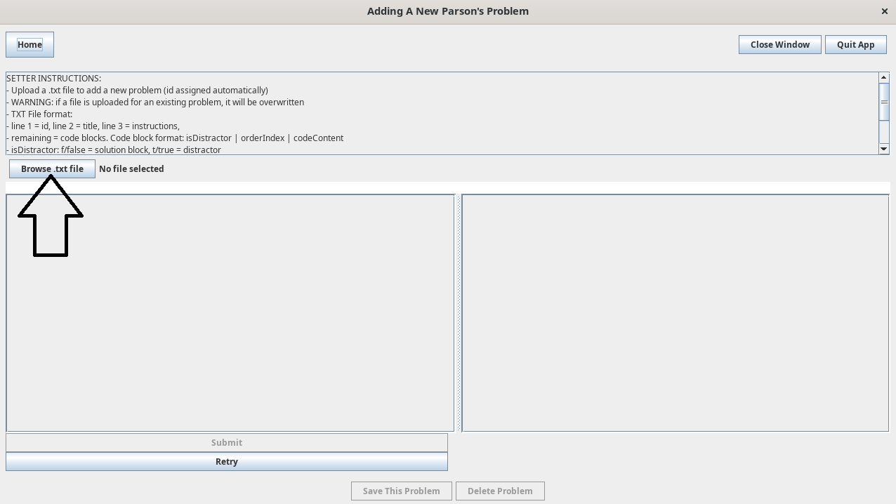

This will open the file chooser dialog, allowing selection of a file. Once selected, the file can be opened to import it into the editor view.


If the user chose to update an existing problem, they will be warned that they will be overwriting the current problem by uploading a new file.

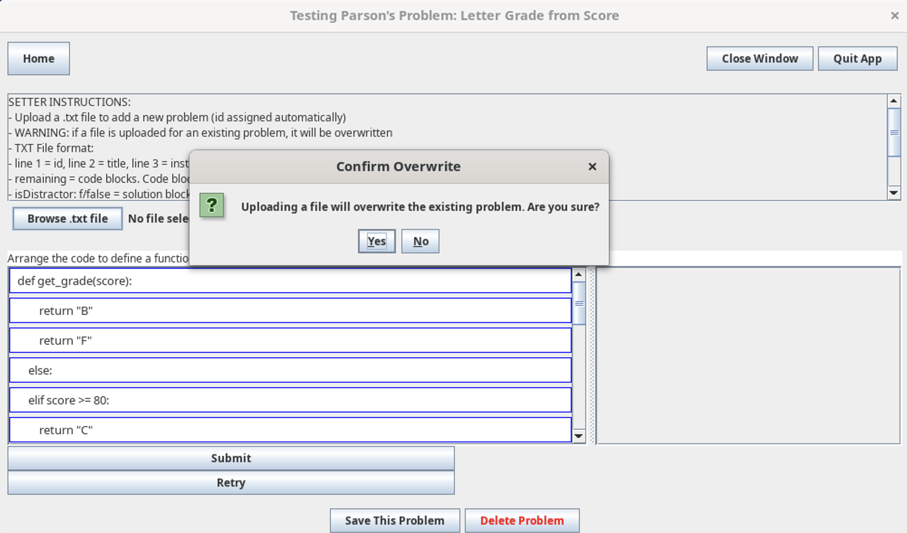

Now that the problem has been imported, the setter can test the problem for themselves. The problem can then be saved to the local repository by clicking "Save this Problem".

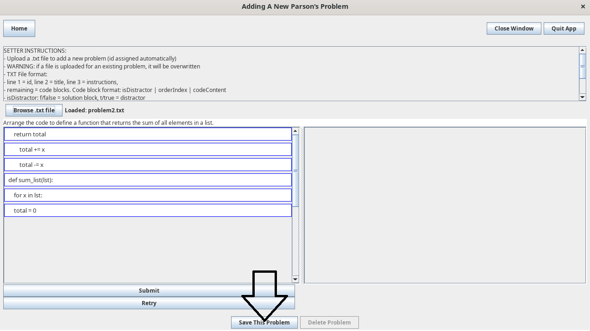

If the user is updating an existing problem, they'll receive a warning when they save the problem to the local repo.

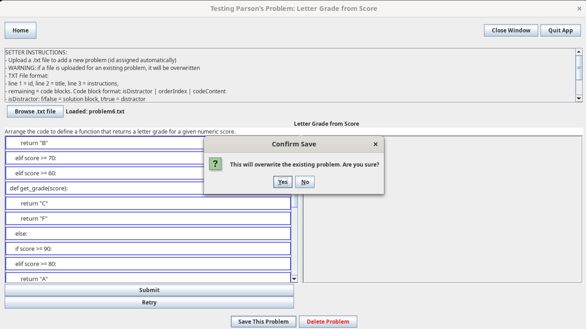

After the button press, a successful save notification will appear. 


The editor view will then close, and the user will be brought back to the setter's welcome view.


### Setter Instructions: Defining Problem Source Files

New Parsons problems are defined via `.txt` files. Problem parsing relies on a specific document format; the GUI expects a single problem, but the CLI allows bulk problem additions (see CLI section below).

The structure of a single problem is as follows:
    * Problem Title
    * Problem Instructions
    * Problem Code Blocks

A code block is built from each line of the problem; these code blocks each define their own draggable element, and are made up of three parts delimited by pipes "|".

```text
    f|0|def is_positive(n):
```

First is the `is_distractor` boolean `(f/t)`. This is used to determine whether this code block has to be included in student's solution. Second is the order index which is used to determine whether the student added the code block in the correct position. Finally, the actual code content of the line is included. Below is a fully defined example problem:

```text
Check if a Number is Positive
Arrange the code to define a function that returns True if n is positive, False otherwise.
f|0|def is_positive(n):
f|1|    if n > 0:
f|2|        return True
f|3|    else:
f|4|        return False
t|1|    if n >= 0:
```

To build a multi problem file, all aforementioned rules apply with one distinction; problems are delimited via "---". To illustrate, the text of a full multi problem file is included below:

```text
Check if a Number is Positive
Arrange the code to define a function that returns True if n is positive, False otherwise.
f|0|def is_positive(n):
f|1|    if n > 0:
f|2|        return True
f|3|    else:
f|4|        return False
t|1|    if n >= 0:
---
Sum a List Using a For Loop
Arrange the code to define a function that returns the sum of all elements in a list.
f|0|def sum_list(lst):
f|1|    total = 0
f|2|    for x in lst:
f|3|        total += x
f|4|    return total
t|3|        total -= x

```

### Setter Instructions: Bulk Adding Problems via CLI
To bulk add multiple problems from a single file, run the program with two additional arguments: the `-cli` flag, and the relative path to the source `.txt` file; if running via gradle, the full command is:

```
java -jar parsons-problem-tool-0.1.jar -cli ./path/to/file
```

