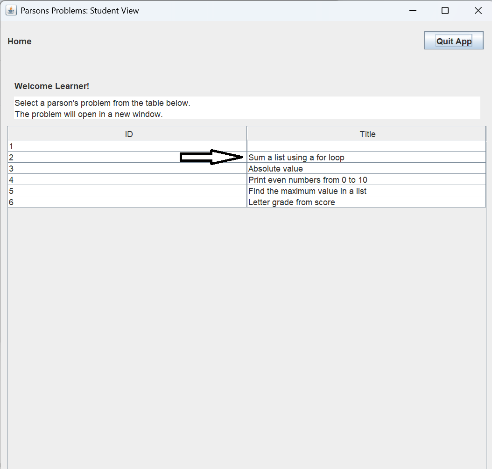
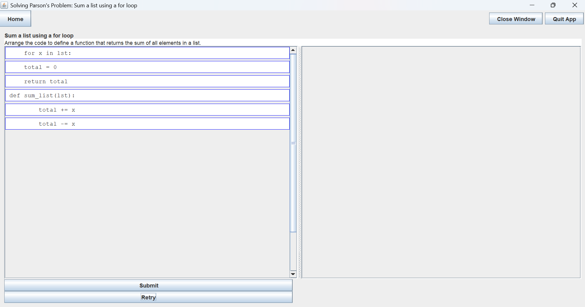
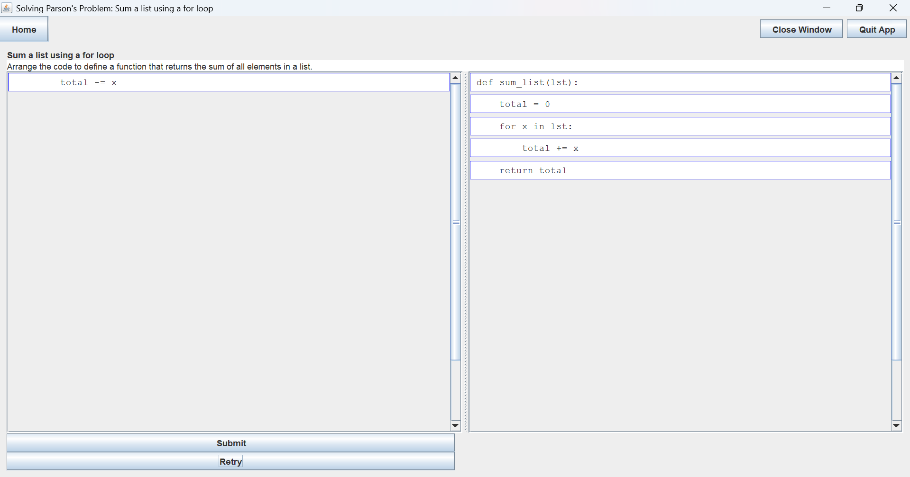
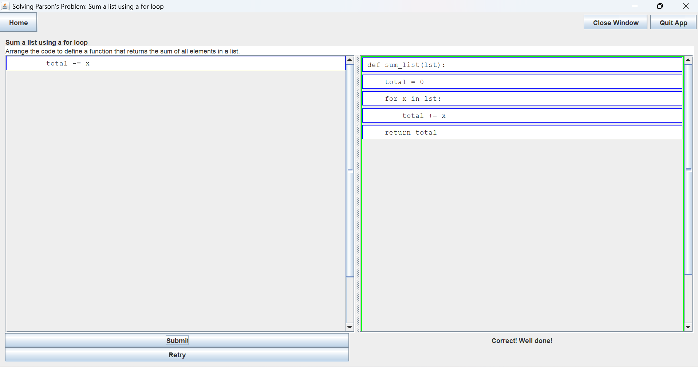
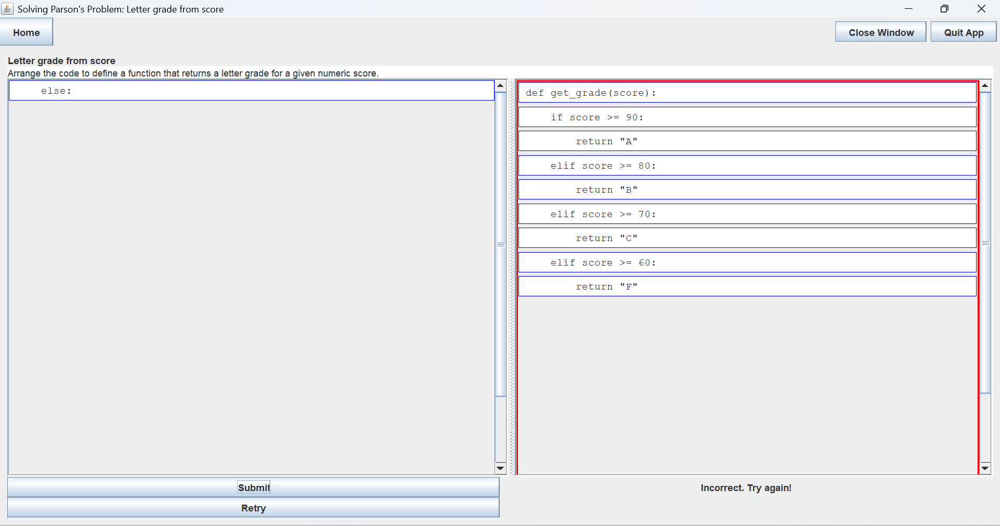
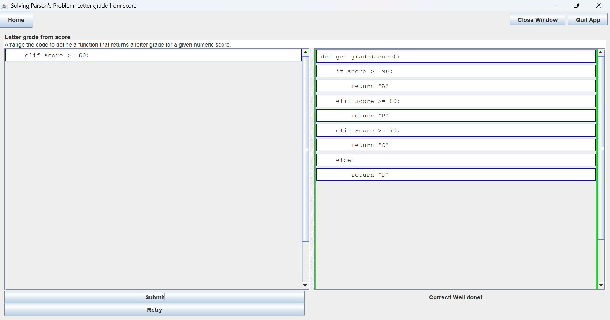

After selecting a problem to solve, the user clicks on it to open the Solver View screen,
   

 where the problem details are displayed. At any time, the user can exit the program by clicking `Close Window`, `Quit App`, or the `X` in the
 top right corner of the frame.   

   

The left-hand side of the solving problem screen contains puzzle pieces of a problem arranged in 
no particular order. In addition to the correct code, it also contains distractor piece(s).   

   

The user moves puzzle pieces from the left side of the screen to the right side and arranges them
in a presumably correct order. The pieces can only be added at the bottom.   

   

They can, however, be moved from the top or the middle to the bottom, or removed altogether and returned
 to the left-hand side of the screen.   
 Once the user is satisfied with the order of the code puzzle pieces, clicking `Submit` will check if
 the answer is correct.     

    

 If the answer is incorrect, the user can try again by clicking the `Retry`button and the puzzle pieces will
 reshuffle to the beginning.      

 
 
Another option in case of an incorrect answer,    

if the user sees the minor mistake and would like to correct it
right away, they can move back the few  incorrect pieces,   
   

rearrange them correctly, and try again by clicking `Submit`:   

