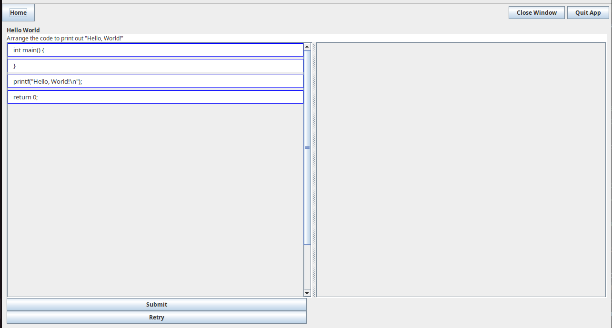

<!-- 
(remove this and add your sections/elements)
This readme should contain the following information: 

* The group member's names and github accounts
* The application name and a brief description of the application
* Links to design documents and manuals
* Instructions on how to run the application

Ask yourself, if you started here in the readme, would you have what you need to work on this project and/or use the application?
-->

# Final Project for CS 5004 - Parsons Problem Authoring & Delivery Tool

## Authors: (Group 1)
### McKillop, Parker @pem2k
### O'Bannon, Michael @oban2319
### Pooley, Oksana @OksanaPooley
### Singh, Arsh @arshsinghphd

**Name and Description**
Our project application is called "Parsons Problem". This application that has two major aspects. The first of them being
an interactive educational tool where the user attempts to solve some problem. Second, it provides the environment for an
educator to upload new problems. The problems themselves are called Parsons Problems. These are an effective way for
teaching programming concepts. The user, normally a student, will attempt to arrange blocks of code into the
correct order from top to bottom.

[Design Document](DesignDocuments/README.md)

Manual - _link still needed!_

**Instructions**
When the application starts, the user will be greeted with a welcome screen. Once here, the user will be asked to input
an account name. Next, they will choose their role, selecting whether they are _student_ (solving a problem) or
a _setter_ (uploading a problem).

When the student option is selected. The user will be taken to the next screen. It will contain (normally) several problems
and the user will select one of them, taking them to the Parsons Problem itself.

Once we are in this environment, we might have the following four blocks of code:

It will be up to the user to drag and drop each of the block into the order that produces the correct coding structure.
Once the user has determined that they have solved the problem they simply click the submit button. They will be greeted
by a green outline if they produced the correct answer, and it will say "Correct! Well done!" In the alternative case,
a red outline will appear, and the window will say "Incorrect. Try again!".

During the participation of some problem, the user will have several options at hand.
Firstly, they can retry the problem at any point by clicking the _Retry_ button. This will return the blocks to their initial locations, so that the
problem could be attempted once more.
Secondly the user may return home at any point by clicking the _Home_ button. This will return the user to the previous
screen where they can choose another problem or exit the application.
Thirdly, the user may exit the entire application by clicking the _Quit App_ button. This will end the application.

Naturally, as previously mentioned the user can submit their answer at any point by clicking _Submit_.

For the setter option, as mentioned above, this application can be used as a tool for uploading a Parsons Problem.
The author, normally an educator, can create lines of code with the intention that each line will be broken up so
that the parsons problem can be created. The educator will need to create their code in a .txt file and it must
follow a specific format.

The format is as follows:

_Title_
_Instructions_
_Code Blocks_

Within the _Code Blocks_ section of this file there are some further information required.
Each line must be of the structure _isDistractor_ | _Order Index_ | _Code Content_.
_isDistractor_ is an indicator for whether a line is meant to be distracting line of code; used to create red herrings.
This portion will either affirm that it is a distractor with 't' or is not with 'f'.
_Order Index_ indicates the order of the code, starting with 0 and going for the number of non-distrctor lines.
If something is a distractor line its order index is -1.
_Code Content_ is where the actual code lines are written.